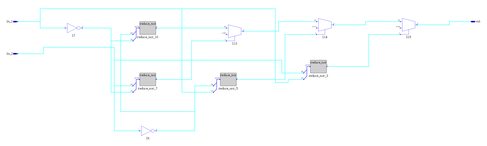
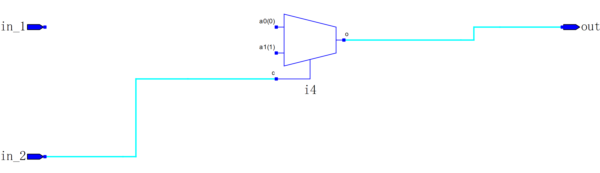
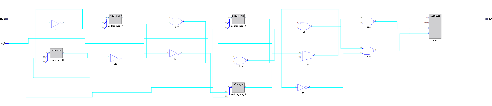
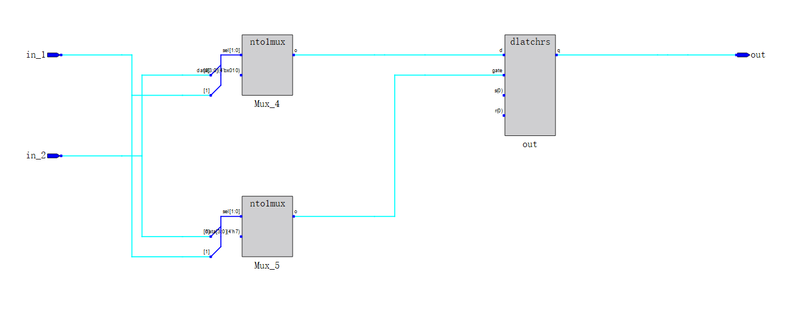
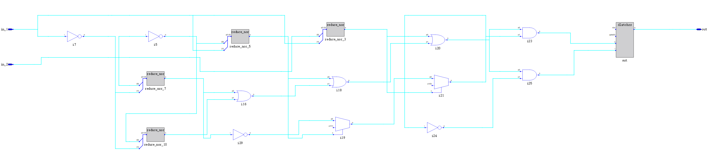
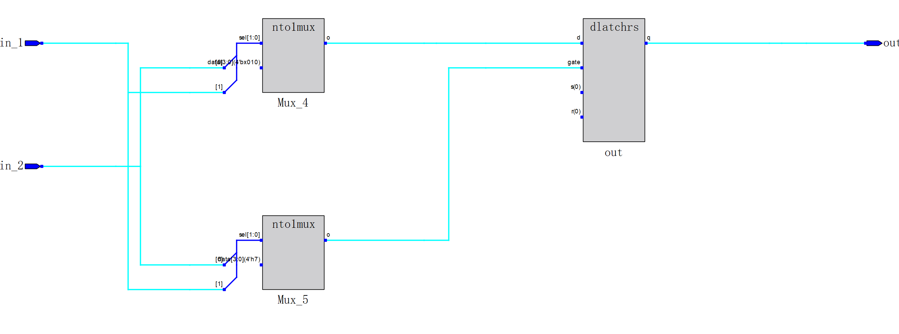

目录
- [产生Latch（锁存器）的几种方式](#产生latch锁存器的几种方式)
  - [正确的代码](#正确的代码)
  - [1. 组合逻辑中赋值给自己](#1-组合逻辑中赋值给自己)
  - [2. 没有使用else 语句](#2-没有使用else-语句)
  - [3. case分支语句未完全列举且没有default分支](#3-case分支语句未完全列举且没有default分支)

# 产生Latch（锁存器）的几种方式

## 正确的代码

这里我们实现了对于译码器的FPGA源码
- 使用if-else语句进行译码
    ```v
    module decoder(
        input wire in_1,
        input wire in_2,

        output reg out
    );

    always@(*) begin
        if ({in_1, in_2} == 2'b00)
            out = 1'b0;
        else if ({in_1, in_2} == 2'b01)
            out = 1'b1;
        else if ({in_1, in_2} == 2'b10)
            out = 1'b0;
        else if ({in_1, in_2} == 2'b11)
            out = 1'b1;
        else 
            out = 1'b0;
    end
    endmodule
    ```
    - 编译后生成的电路图为：
        
        中间那个方形的东西作用类似于“比较器”
- 使用case语句进行译码
    ```v
    module decoder(
        input wire in_1,
        input wire in_2,

        output reg out
    );

    always@(*) begin
        case ({in_1, in_2})
            2'b00: out = 1'b0;
            2'b01: out = 1'b1;
            2'b10: out = 1'b0;
            2'b11: out = 1'b1;
            default: out = 1'b0;
        endcase  //我一开始没有写这个，报错了
    end
    endmodule
    ```
    - 编译后生成的电路图为：
        
        这里你可能有点疑惑为什么in_1没有线，应为高云的IDE为电路简化了，out信号的输出只与in_2有关。

## 1. 组合逻辑中赋值给自己

- 我这里直接用错误的源码演示
    ```v
    module decoder(
            input wire in_1,
            input wire in_2,

            output reg out
        );

        always@(*) begin
            if ({in_1, in_2} == 2'b00)
                out = 1'b0;
            else if ({in_1, in_2} == 2'b01)
                out = 1'b1;
            else if ({in_1, in_2} == 2'b10)
                out = 1'b0;
            else if ({in_1, in_2} == 2'b11)
                out = out; // 错误的地方，这里赋值给自己
            else 
                out = 1'b0;
        end
        endmodule
    ```
    - 编译后生成的电路图为：
        
        这里我们明显看到电路的最后产生了一个长方形的小盒子（Latch）
    ```v
    module decoder(
        input wire in_1,
        input wire in_2,

        output reg out
    );

    always@(*) begin
        case ({in_1, in_2})
            2'b00: out = 1'b0;
            2'b01: out = 1'b1;
            2'b10: out = 1'b0;
            2'b11: out = out; // 错误的地方，这里赋值给自己
            default: out = 1'b0;
        endcase 
    end
    endmodule
    ```
    - 编译后生成的电路图为：
        
        这里我们明显看到电路的最后产生了一个长方形的小盒子（Latch）

## 2. 没有使用else 语句

- 我这里直接用错误的源码演示
    ```v
    module decoder(
        input wire in_1,
        input wire in_2,

        output reg out
    );

    always@(*) begin
        if ({in_1, in_2} == 2'b00)
            out = 1'b0;
        else if ({in_1, in_2} == 2'b01)
            out = 1'b1;
        else if ({in_1, in_2} == 2'b10)
            out = 1'b0;
        else if ({in_1, in_2} == 2'b11)
            out = 1'b1;
        //else 
        //    out = 1'b0;
    end
    endmodule
    ```
    - 编译后生成的电路图为：
        
        这里我们明显看到电路的最后产生了一个长方形的小盒子（Latch）

## 3. case分支语句未完全列举且没有default分支
- 我这里直接用错误的源码演示
    ```v
    module decoder(
        input wire in_1,
        input wire in_2,

        output reg out
    );

    always@(*) begin
        case ({in_1, in_2})
            2'b00: out = 1'b0;
            2'b01: out = 1'b1;
            2'b10: out = 1'b0;
            //2'b11: out = 1'b1;
            //default: out = 1'b0;
        endcase
    end
    endmodule
    ```
    - 编译后生成的电路图为：
        
        这里我们明显看到电路的最后产生了一个长方形的小盒子（Latch）
    
