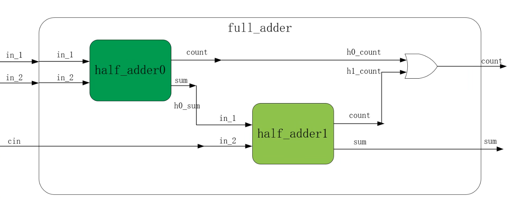

- [全加器](#全加器)
  - [逻辑介绍](#逻辑介绍)
  - [FPGA实现](#fpga实现)

# 全加器

## 逻辑介绍
我在一开始不知道全加器是两个半加器的组合，也怪我在大一的时候没有学好数电模电。  
这里我将全加器的设计框图放在这里   
    

## FPGA实现
```
补充：4.什么情况下使用reg型变量
    （1）变量放在begin……end之内必须使用reg变量
    （2）在initial语句中使用
```

**源代码**(我们根据上图编写一下代码)  
```v
module full_adder(     //定义全加器模块
    input wire in_1,
    input wire in_2,
    input wire cin,

    output wire sum,
    output wire count
);

wire h0_count;      //声明中间我们连线用的端口名字，或者你可以理解我们给连线取名字
wire h0_sum;
wire h1_count;

half_adder half_adder_inst0(  //创建实例half_adder_inst0，我们复用了半加器的模块
    .in_1(in_1),              //相当于实例化后的端口与其他端口连线
    .in_2(in_2),

    .sum(h0_sum),
    .count(h0_count)
);

half_adder half_adder_inst1(
    .in_1(h0_sum),
    .in_2(cin),

    .sum(sum),
    .count(h1_count)
);

assign count = (h0_count | h1_count);   //输出的信号为wire类型，我们需要用assign
endmodule
```

**仿真代码**（你可以理解为又写了一遍verilog代码）
```v
`timescale 1ns/1ns   //设置仿真时间单位
module tb_full_adder();   //定义测试模块

reg in_1,in_2,cin;   //定义输入端口
wire sum,count;     //定义输出端口

full_adder full_adder_inst0(  //实例化全加器模块
    .in_1(in_1),
    .in_2(in_2),
    .cin(cin),

    .sum(sum),
    .count(count)
);

always #10 in_1 <= {$radom} % 2;    //每隔10ns并行执行一次
always #10 in_2 <= {$radom} % 2;
always #10 cin  <= {$radom} % 2;

initial begin   //在initial语句中使用
    in_1 <= 1'b0;  //并行赋值
    in_2 <= 1'b0;  
    cin  <= 1'b0;
end

initial begin
    $timeformat(-9,2, " ns", 10);   //设置仿真时间格式
    $monitor("in_1=%b, in_2=%b, cin=%b, sum=%b, count=%b", in_1, in_2, cin, sum, count);   //设置仿真监视器，输出端口值
end
```
- 我将别人写的仿真代码给优化了一下，让他符合我写代码的习惯，但是我又一点无法理解，就是为什么要分成两个initial块，为此我询问了一下ChatGPT，他给出的解释是：  
    在 Verilog 中，分开的 `initial` 块可以用于不同的目的，主要有以下几个原因：

    1. **可读性**：将不同功能的代码分开可以提高代码的可读性。一个 `initial` 块专注于信号的初始化，另一个专注于仿真监控，这样便于理解和维护。

    2. **执行顺序**：虽然多个 `initial` 块是并行执行的，但在某些情况下，设计者可能希望先进行某些初始化，然后再设置监视器。虽然在大多数情况下这并不影响功能，但在某些复杂的设计中，这种分隔可以提供更清晰的逻辑结构。

    3. **调试**：在调试过程中，可能需要单独观察信号的变化和状态。将监视器放在单独的 `initial` 块中，可以方便地启用或禁用监视器，而不影响其他初始化代码。

    4. **代码复用**：在较大的设计中，可能会有多个不同的 `initial` 块，分别用于不同的测试场景。这样可以方便地复用和修改特定的块，而不影响其他部分。

    总的来说，分开的 `initial` 块使得代码更加模块化和灵活，但在简单的情况下，合并也是完全可行的。选择哪种方式取决于个人的编码习惯和项目的复杂性。 
