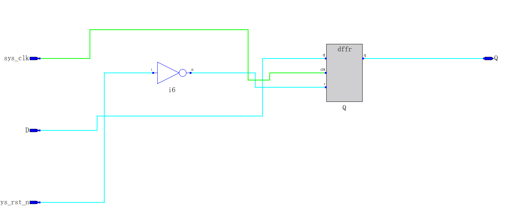

- [时序逻辑的开始](#时序逻辑的开始)
  - [D触发器](#d触发器)
    - [同步复位](#同步复位)
    - [异步复位，同步释放](#异步复位同步释放)
    - [D触发器的FPGA实现](#d触发器的fpga实现)

# 时序逻辑的开始

## D触发器
寄存器的开始，每个D触发器能够存储一位二进制码。  
- D触发器有三个输入信号：
  - `sys_clk`：时钟信号
  - `D`：数据输入信号
  - `sys_rst_n`：复位信号，低电平有效
  - `Q`：输出信号

### 同步复位
这个好理解，因为我们引入了时钟信号，作用就是同步信号。  
但在需要复位时，时钟信号出现了问题，就无法正常复位，所以同步复位的电路稳定性较差。    

### 异步复位，同步释放
既然复位受是信号的影响而导致电路稳定性较差，那么我们就让**复位不受时钟信号的影响**。  
但是这样我们会导致**复位后的信号位置不确定**，这对时序逻辑电路的设计有很大的影响。  
所以我们需要同步释放复位信号，让**复位的信号与时钟上升沿对齐**。  

### D触发器的FPGA实现
- 源代码（同步复位）
  ```v
  module d_trigger(
      input wire sys_clk,
      input wire D,
      input wire sys_rst_n,

      output reg Q
  );

  always@(posedge sys_clk) begin  //同步复位
      if (sys_rst_n == 1'b0) begin 
          Q <= 1'b0;
      end 
      else begin
          Q <= D;
      end
  end
  endmodule
  ```
  - 进行编译后，生成的电路图是这样的：
      
- 源代码（异步复位，同步释放）
  ```v
  module d_trigger(
      input wire sys_clk,
      input wire D,
      input wire sys_rst_n,

      output reg Q
  );

  always@(posedge sys_clk or negedge sys_rst_n) begin  //异步复位，同步释放
      if (sys_rst_n == 1'b0) begin 
          Q <= 1'b0;    // 异步复位，复位输出为0
      end 
      else begin
          Q <= D;    // 在时钟上升沿更新输出
      end
  end
  endmodule
  ```
  - 进行编译后，生成的电路图是这样的：
      
      我想吐槽一下高云的RTL画图，真的很烂。

## 赋值语句
### 阻塞赋值
- 阻塞赋值是按照顺序执行，我们直接用代码来说明，更加直观
  ```v
  a = 1;
  b = 2;
  c = 3;

  begin
    a = b+c;
    b = c+a;
    c = a+b;
  end
  ```
  - 那么这个执行的结果是什么呢？先计算b+c后赋值给a，这时候c+a就是8
    ```v
    a = 5
    b = 8
    c = 13
    ```
### 非阻塞赋值
- 非阻塞赋值只能运用到`reg`类型变量，并且赋值语句必须在`always`块中或者`initial`块中。不允许在`assign`中进行赋值。
- 非阻塞赋值你可以理解为，我们是同时进行的
  ```v
  a = 1;
  b = 2;
  c = 3;

  begin
    a <= b+c;
    b <= c+a;
    c <= a+b;
  end
  ```
  - 那么这个执行的结果是什么呢？
    ```v
    a = 5
    b = 4
    c = 3
    ```
